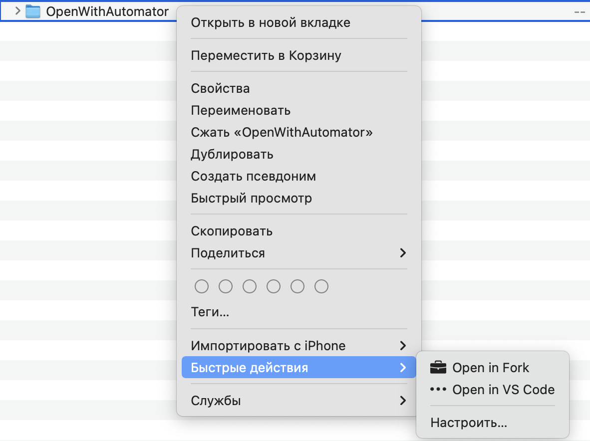
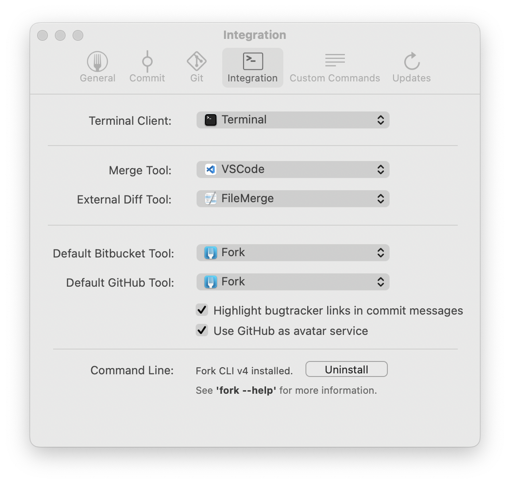

# OpenWithAutomator
Readme in other languages:

[RU :ru:](./README/README-RU.md)

This repository contains Automator scripts to help you open files or folders in the application you need without running the application. Simply use the serives in the Finder file menu.

<picture>
  <source media="(prefers-color-scheme: dark)" srcset="/../../raw/main/Images/RU/Finder-example-dark.png">
  <source media="(prefers-color-scheme: light)" srcset="/../../raw/main/Images/RU/Finder-example.png">
  
</picture>

## VS Code:
To open your files or programs in VS Code (Microsoft Visual Studio Code): 
* [Download the script](/../../raw/main/Open%20in%20Fork.zip)
* Unzip downloaded file
* Run unziped file

You don't need to take any additional actions to use the script.

## Fork
[Fork](https://fork.dev) is a simple and easy-to-use GUI for Git. To enable script support, go to Fork settings. Install **Fork CLI** in the *Integration* tab of settings at the bottom of the page.

<picture>
  <source media="(prefers-color-scheme: dark)" srcset="/../../raw/main/Images/Fork-cli-dark.png">
  <source media="(prefers-color-scheme: light)" srcset="/../../raw/main/Images/Fork-cli.png">
  
</picture>

[Download](/../../raw/main/Open%20in%20Fork.zip), unpack and run the script.

## Uninstall and editing
All sevices are installed in the following path:
```
/Users/YOUR_USER/Library/Services
```
Open the script if you need to change it

## How it works
When a service is started, a path is passed to the Shell script in automaton, based on which any application is called
Since multiple paths can be passed to a command, a For loop is used.
```bash
for f in "$@"
do
some your command here $f
done
```
To use the value of f, use `$f` where you need it.

## Create your own script
- Open Automator
- File -> New -> Service 
- Change «Service Receives» to «files or folders» in «Finder» 
- Add a «Run Shell Script» action 
- Change «Pass input» to «as arguments» 
- Paste in the shell script box your code
- Save it with your script name

Thanks to the [tonysneed](https://github.com/tonysneed) for the [guide](https://gist.github.com/tonysneed/f9f09bfa28bcf98e8d8306f9b21f99e2)
